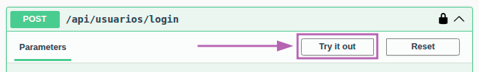
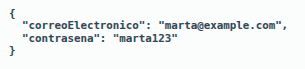
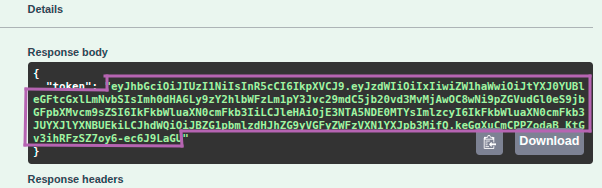
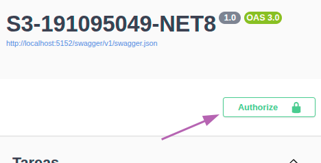
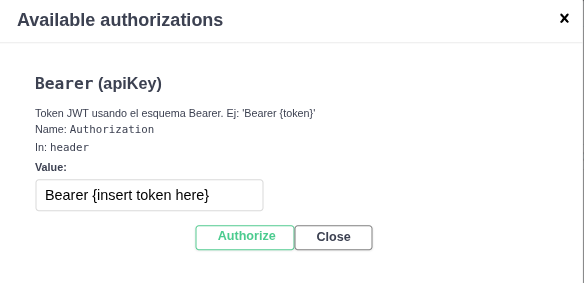

# Solemne 3  
    Tomas Castillo A  

## Requisitos técnicos
    - dotnet 8  
    - PostgreSQL 16.9  
  

## Reseña básica del proyecto
### descripción breve de la finalidad 
Este proyecto permite administrar tareas personales de distintos usuarios. La finalidad principal es gestionar tareas básicas como crearlas, editarlas, eliminarlas y obtener un listado de las tareas asignadas a cada usuario. Además, se implementa un sistema de autenticación con JWT para proteger los recursos y asegurar que solo los usuarios autorizados puedan acceder a sus propias tareas.

### funcionalidad principal de la API.
La API permite que un usuario pueda registrarse y luego iniciar sesión para recibir un token de autenticación. Con este token, el usuario puede acceder a los distintos endpoints que le permiten crear nuevas tareas, consultar sus tareas pendientes, actualizarlas o eliminarlas según corresponda. Cada tarea se guarda en la base de datos con su título, descripción, fecha de vencimiento y estado de completada. Además, se implementa control de acceso mediante roles y se asegura que los datos estén protegidos mediante contraseñas encriptadas y tokens válidos para cada sesión.  

## Instrucciones de instalación: 
### cómo configurar
Una vez de que esten satisfechos los requisitos tecnicos, con el servicio PostgreSQL corriendo, se debe:
1. Asegurar de que la base de datos `AdministradorTareas` este creada, de no ser el caso ejecutar el scripts `BaseDatos/CrearBaseDatos` para crear la base de datos
2. Conectar a la base de datos con el usuario `postgres` y contraseña `admin` (o modificar appsettings.json con tus credenciales PostgreSQL)
3. Ejecutar `BaseDatos/PoblarBaseDatos.sql` para poblar la base de datos con tablas
4. Ejectuar `BaseDatos/dummy.sql` para agregar un usuario dummy a la base de datos

### ejecutar el proyecto.
1. arrancar el backend  
   
        dotnet run

* Autenticarse
1. Abrir el navegador y acceder a `https://localhost:5001/swagger` para ver los endpoints

* Proceso de autenticacion
1. Crear un usuario nuevo o utilizar el usuario dummy tras ejecutar `BaseDatos/dummy.sql`
2. con un usuario creado, ingresar al endpoint `/api/usuarios/login` con el usuario y contraseña para obtener un token de acceso  

    **Credenciales**  

        correo:     marta@example.com  
        password:   marta123  

  

Ingresar credenciales  

  

Execute  

  

Extraer token  

  

Entrar a Authorize  

  

Ingresar "Bearer token123129..."  

   

## Base de datos  
    usuario: postgres  
    password: admin  

* Crear base de datos local  
    1. Postgresql debe estar funcionando de manera local  
    2. Ejecutar `BaseDatos/CrearBaseDatos.sql`  
